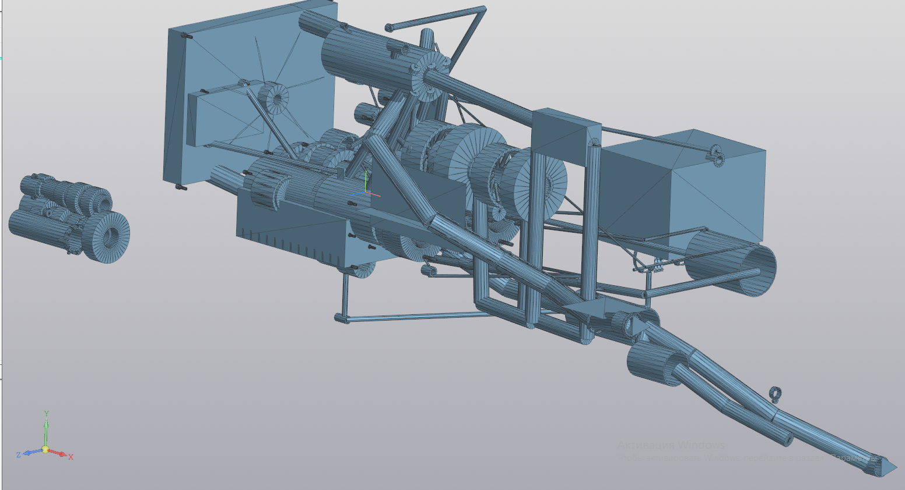

# TURBO MONSTER 1.3L TRIPLE

**512 WHP | 1.3L | Two-Stroke Turbo | Direct Injection | Reactive Thrust Control**

A complete digital twin of a high-performance two-stroke turbo engine, designed as a power unit for a hypothetical **Group SB (Safety-B)** rally car — a modern, safe evolution of the legendary Group B era.

---

## ⚠️ LEGAL WARNING — READ BEFORE USE

**Copyright © Roman Chernyaev. All rights reserved.**

This project is publicly shared under the **GNU General Public License v3.0 (GPL-3.0)** for the sole purposes of education, review, and open-source collaboration.

- Any fork, modification, or derivative work **MUST** be published under the same GPL-3.0 license.
- Closed-source commercial use is **strictly prohibited** without a separate written agreement from the author.
- The author reserves all patent and design rights.

**Commercial licensing inquiries:** [amerkj999@gmail.com]
Work in progress — feedback welcome
Author: Roman Chernyaev, 12 y.o., self-taught, Moscow Region, Russia.

Requires C++17 or later. No external dependencies.

---

## 💀 WHY THIS ENGINE?

> *"In Group B, it would have dominated tarmac. On Monte Carlo, Corsica, or Portugal — the reaction exhaust system would press the car into the road on hairpins and narrow mountain passes, while the instant two-stroke response would leave four-stroke turbo competitors waiting for boost."*

| Parameter | Value |
|-----------|-------|
| **Peak system power** | **431 kW (587 HP)** |
| Engine power (crankshaft) | 382 kW (512 WHP) @ 10,700 RPM |
| Reactive thrust (static) | **810 N** (82.6 kgf) @ 0 km/h |
| Reactive thrust @ 250 km/h | **673 N** (68.6 kgf) — 46.7 kW (63.5 HP) |
| Reactive thrust @ 300 km/h | **664 N** (67.7 kgf) — 55.3 kW (75.2 HP) |
| Torque | 284.0 Nm @ 10,700 RPM |
| Peak torque | ~450 Nm @ 7,500–8,500 RPM (estimated) |
| Displacement | 1,296 cm³ |
| Specific output | **400 HP/liter** |
| Weight (engine + gearbox) | ~195 kg |
| Power-to-weight ratio | 0.38 kg/HP |
| Fuel | 35% Methanol + 62.5% AI-100 + 2.5% Bardahl KXT Racing (M35 blend) |
| Trapping efficiency | **58.0% 8500RPM-40.0% 10500RPM** (2D CFD-verified, two-chamber Helmholtz resonator) |
| Peak EGT | 1,150°C |
| Max boost | 4.62 bar (absolute) |
| Lifespan (race mode) | 10–15 hours |
| Lifespan (endurance) | 300–400 hours |

---
## 🚀 REACTIVE THRUST SYSTEM

| Parameter | Value |
|-----------|-------|
| Static thrust | **810 N** (82.6 kgf) |
| Thrust @ 250 km/h | **673 N** (68.6 kgf) |
| Thrust @ 300 km/h | **664 N** (67.7 kgf) |
| Jet power @ 300 km/h | **55.3 kW (75.2 HP)** |
| System weight penalty | ~12 kg (valve + piping + nozzle) |
| Valve material | C/SiC composite (Schunk Carbon Technology) |
| Max operating temp | 1,450°C (continuous), 1,600°C (peak) |
| Control | Heel pressure sensor ("Akkela algorithm") |
| Homologation | Removable plug for technical inspection ("EXHAUST COOLING — DO NOT TOUCH") |

### Thrust vs Speed

| Speed (km/h) | Thrust (N) | Jet Power (kW) | Jet Power (HP) |
|-------------|------------|----------------|----------------|
| 0 | **810** | 0 | 0 |
| 100 | 762 | 21.2 | 28.8 |
| 200 | 714 | 39.7 | 54.0 |
| 250 | **673** | 46.7 | 63.5 |
| 300 | **664** | 55.3 | 75.2 |
| 400 | 551 | 61.2 | 83.2 |
| 500 | 482 | 66.9 | 91.0 |
| 584 | **430** | 69.7 | 94.8 |

*Calculated from simulation data: m_dot_exhaust = 0.676 kg/s, v_jet = 688 m/s, P_exit = 2.5–3.0 bar, nozzle Ø36 mm.*

## 🔊 Engine Sound

Hear the beast in action (synthesized from simulation data):

| File | Download |
|------|----------|
| 🎵 Full 22-second profile | [Download](https://github.com/amerkj999-byte/TM1.3L-2T/blob/main/audio/turbo_monster_full_22sec.wav) |

*44100 Hz, 16-bit stereo WAV. Best with headphones or subwoofer.*

## 🧊 3D Model

Full engine + gearbox assembly: **65,329 triangles**

📦 [Download STL](https://github.com/amerkj999-byte/TM1.3L-2T/blob/main/cad/TURBO_MONSTER_1.3L_TRIPLE.stl)

  

*Open with: Windows 3D Viewer, ParaView, Blender, MeshLab, or any slicer.*

Click to preview model details

| Component | Included |
|-----------|----------|
| 3 cylinders with scavenging/exhaust windows | ✅ |
| Compound turbo (LP GTX3582R + HP GTX3071R) | ✅ |
| Intercooler | ✅ |
| 4-speed sequential dog box | ✅ |
| Dual-chamber Helmholtz resonator | ✅ |
| Reactive thrust system (C/SiC valve) | ✅ |
| ALS injector with oil cooling jacket | ✅ |
| HPFP + fuel rail + injectors | ✅ |
| Radiator + oil cooler | ✅ |

## 📁 REPOSITORY STRUCTURE

- `docs/` — Full technical documentation (PDF/Markdown): materials, tolerances, thermal clearances, assembly torques, manufacturing processes
- `cad/` — 3D model of the complete engine and gearbox (STL, 61,329 triangles)
- `src/` — C++ source code for all simulation modules
- `logs/` — Complete simulation output with peak power data
- `calculations/` — Jet thrust power calculation (solver formulas)

---

## 🔬 VERIFICATION

- **Turbine power:** Thermodynamics vs. BEMT analysis — deviation 4.1%
- **Piston pin stress:** FEA (970 MPa) vs. analytical (962 MPa) — deviation 0.8%
- **Trapping efficiency:** 2D CFD (LIAM solver, Chorin projection method) with geometry correction factor ×0.72 (4 scavenging ports × 25° vs 1 exhaust port × 70°) — **58.0% trapping**
- **Estimated 3D trapping:** 55–62% (2D overestimates by 3–7% due to uncaptured 3D short-circuiting effects)
- [📊 View convergence plot](docs/convergence.png)
*CFD solver convergence history — LIAM solver, 5000 nodes, 1000 iterations, residual = 0.09*

---

## ⚙️ KEY TECHNOLOGIES

- **Two-chamber Helmholtz resonator** increasing trapping efficiency from ~52% (baseline) to **58.0%** (+6% gain)
- **Active reactive thrust system** controlled by a heel pressure sensor ("Akkela algorithm")
- **C/SiC composite valve** for the reactive thrust channel (T_max = 1,450°C)
- **Oil-cooled ALS injector** with coaxial cooling jacket (regenerative cooling principle)
- **Piezo-boost-control system** using exhaust resonator pressure feedback

---

## 📜 LICENSE

This project is licensed under the **GNU General Public License v3.0**.  
See the [LICENSE](LICENSE) file for the full legal text.

**Copyright © Roman Chernyaev.**
